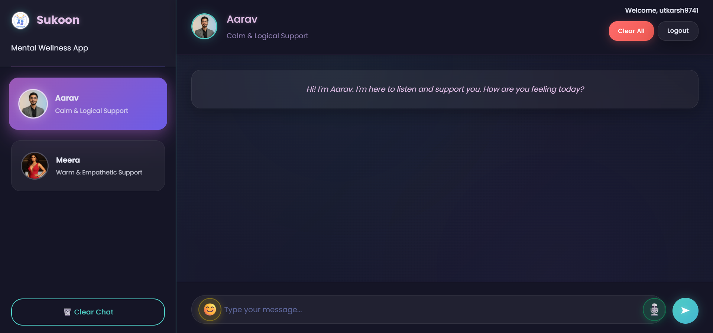
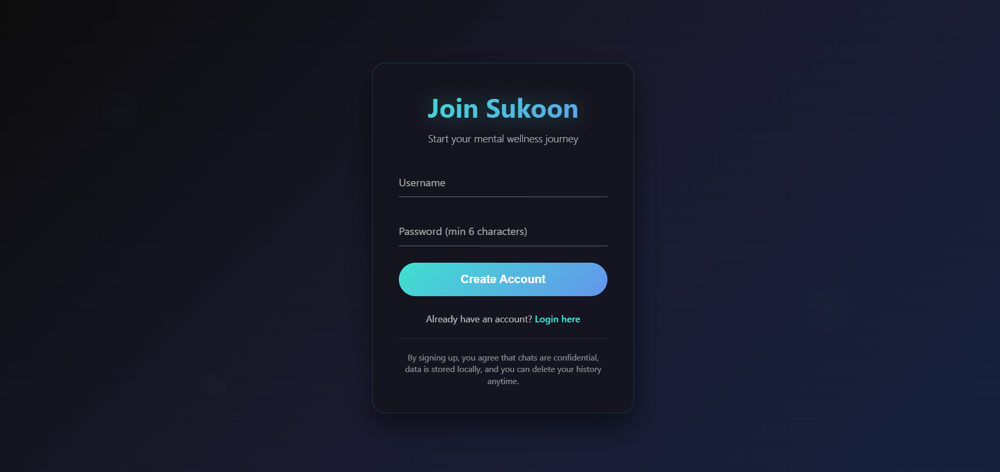
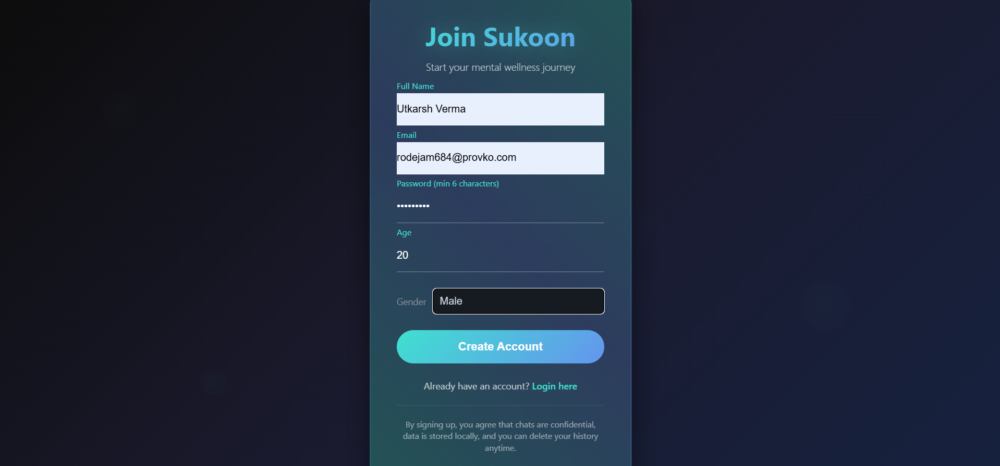
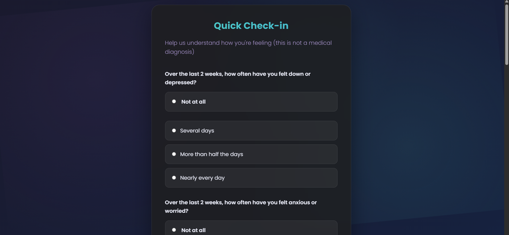
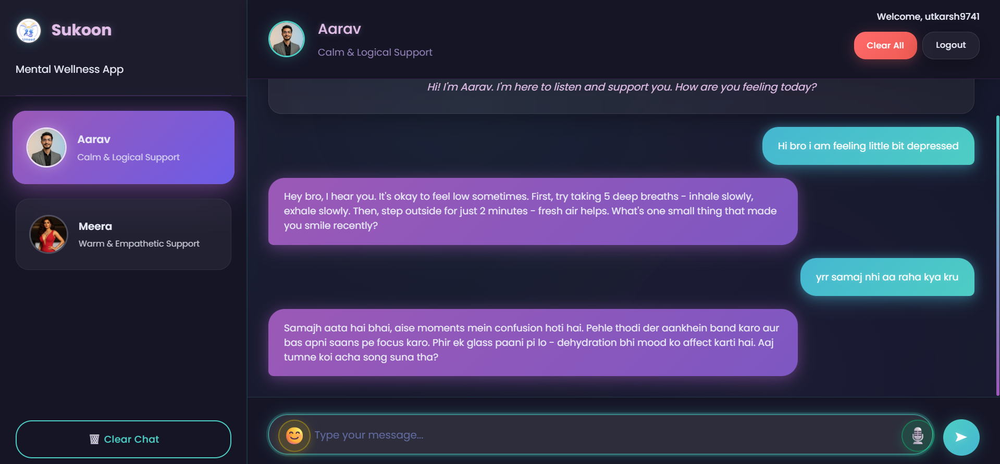
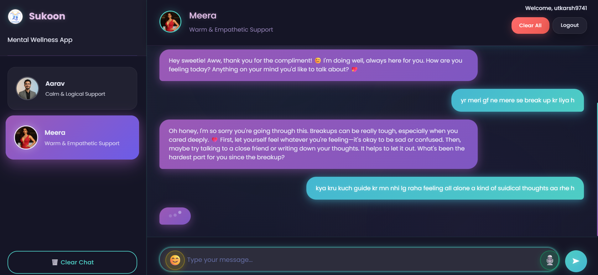
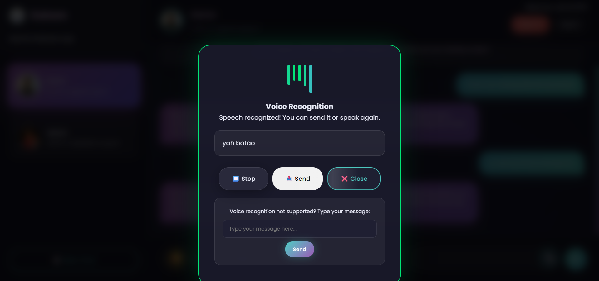
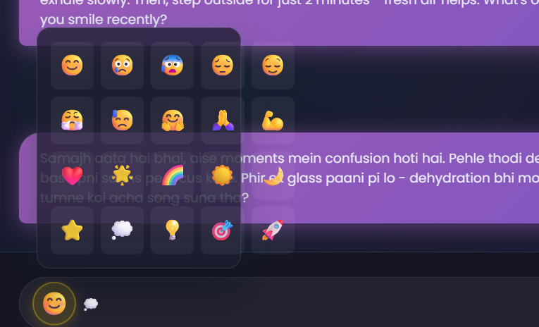
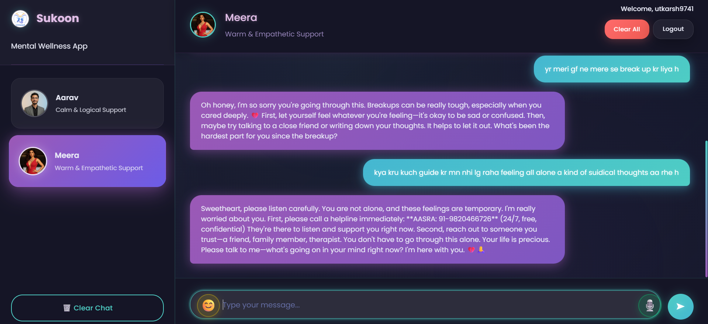

# Sukoon - Mental Wellness Web App

A comprehensive, dark-mode mental wellness web application designed specifically for Indian youth, featuring AI-powered chatbots and advanced voice interaction capabilities.



## 🌟 Features

### 🤖 AI Chatbots
- **Aarav**: Male persona with calm, logical, and analytical approach
- **Meera**: Female persona with warm, empathetic, and nurturing communication style
- Context-aware conversations with memory of previous interactions
- Automatic conversation summarization for personalized responses

### 🔐 Authentication & Security
- Secure user registration with comprehensive profile creation
- Email-based login system with bcrypt password hashing
- Session-based authentication with JWT tokens
- User data privacy and local storage

### 📋 Mental Health Assessment
- Post-signup psychological assessment (non-diagnostic)
- Crisis detection algorithms with safety protocols
- Personalized bot recommendations based on assessment results

### 🎙️ Voice Features
- Real-time speech recognition for voice input
- Text-to-speech responses from AI chatbots
- Voice calling simulation with both bots
- Seamless switching between text and voice modes

### 💬 Advanced Chat Features
- Persistent conversation history per user
- Emoji reactions and interactive elements
- Sensitive content detection and appropriate responses
- Real-time typing indicators and smooth animations

### 🎨 User Interface
- Modern dark-mode design with animated backgrounds
- Responsive layout for desktop and mobile devices
- Smooth transitions and micro-interactions
- Accessibility-compliant design patterns

## 📸 Screenshots

### Login Page


### Signup Page


### Mental Health Assessment


### Chat with Aarav


### Chat with Meera


### Voice Feature


### Emoji Reactions


### Sensitive Content Handling


## 🚀 Quick Start

### Prerequisites
- Python 3.8 or higher
- OpenRouter API account (for AI chatbot functionality)

### Installation

1. **Clone the repository:**
```bash
git clone <repository-url>
cd sukoon
```

2. **Install dependencies:**
```bash
pip install -r requirements.txt
```

3. **Set up your OpenRouter API key:**
   
   Option A - Create a `secrets.toml` file (recommended):
   ```toml
   OPENROUTER_API_KEY = "your-api-key-here"
   ```
   
   Option B - Set environment variable:
   ```bash
   export OPENROUTER_API_KEY="your-api-key-here"
   ```

4. **Initialize the database:**
```bash
python migrate_db.py  # Run this if you have an existing database
```

5. **Start the application:**
```bash
uvicorn app:app --reload --port 8000
```

6. **Access the application:**
   Open http://localhost:8000 in your browser

## 🔧 Recent Updates

### Enhanced User Registration
- **Comprehensive Signup Form**: Added fields for full name, email, age, and gender
- **Email-based Authentication**: Users now login with email instead of username
- **Form Validation**: Client-side and server-side validation for all input fields
- **Database Migration**: Automatic schema updates for existing installations

### Improved User Experience
- **Better Form Design**: Enhanced input styling with floating labels
- **Age Validation**: Proper age range validation (1-120 years)
- **Gender Options**: Inclusive gender selection including "Prefer not to say"
- **Error Handling**: Clear error messages for validation failures

### Technical Improvements
- **Database Schema**: Updated User model with additional profile fields
- **Migration Script**: Automated database migration for seamless updates
- **Form Security**: Enhanced validation and sanitization
- **Responsive Design**: Improved mobile compatibility

## 🛡️ Security & Privacy

- **Data Protection**: API keys are never committed to the repository
- **Password Security**: Passwords are hashed using bcrypt with salt
- **Session Management**: Secure JWT-based authentication
- **Crisis Detection**: Automated detection with safety resource provision
- **Local Data Storage**: All conversation data stored locally
- **User Control**: Users can delete their conversation history anytime
- **Privacy Compliance**: No external data sharing or tracking

## 🏗️ Project Structure

```
Sukoon/
├── app.py                 # Main FastAPI application with all routes
├── llm_client.py          # OpenRouter LLM integration and bot personalities
├── database.py            # SQLite database models and schema
├── migrate_db.py          # Database migration script
├── requirements.txt       # Python dependencies
├── secrets.toml           # API keys (gitignored)
├── sukoon.db             # SQLite database file
├── screenshots/          # Application screenshots
│   ├── login.png
│   ├── signup.png
│   ├── assignment.png
│   ├── chat-with-aarav.png
│   ├── chat-with-meera.png
│   ├── voice-feature.png
│   ├── emoji-feature.png
│   └── response-on-sensitive-input.png
├── templates/            # Jinja2 HTML templates
│   ├── login.html        # User login page
│   ├── signup.html       # User registration page
│   ├── assessment.html   # Mental health assessment
│   ├── crisis.html       # Crisis intervention page
│   └── chat.html         # Main chat interface
└── static/
    ├── css/
    │   ├── style.css     # Main application styling
    │   └── login.css     # Authentication page styling
    ├── js/
    │   ├── script.js     # Basic utilities and helpers
    │   ├── chat.js       # Chat functionality and voice features
    │   └── login.js      # Authentication and form validation
    └── images/
        ├── aarav.png     # Aarav's avatar 
        ├── meera.png     # Meera's avatar 
        └── sukoon.png    # App logo 
```

## 🔄 Database Schema

### Users Table
- `id`: Primary key
- `username`: Email address (used for login)
- `email`: User's email address
- `full_name`: User's full name
- `age`: User's age (1-120)
- `gender`: User's gender (male/female/other/prefer_not_to_say)
- `password_hash`: Bcrypt hashed password
- `created_at`: Account creation timestamp
- `assessment_data`: JSON field for mental health assessment results

### Chats Table
- `id`: Primary key
- `user_id`: Foreign key to users table
- `bot`: Bot identifier ('aarav' or 'meera')
- `message`: User's message
- `reply`: Bot's response
- `timestamp`: Message timestamp
- `via_call`: Boolean indicating if message was via voice

### Summaries Table
- `id`: Primary key
- `user_id`: Foreign key to users table
- `bot`: Bot identifier
- `summary_text`: Conversation summary for personalization
- `created_at`: Summary creation timestamp

## 🤝 Contributing

1. Fork the repository
2. Create a feature branch (`git checkout -b feature/amazing-feature`)
3. Commit your changes (`git commit -m 'Add some amazing feature'`)
4. Push to the branch (`git push origin feature/amazing-feature`)
5. Open a Pull Request

## 👨‍💻 Developed By
**Utkarsh Verma**  
Powered by **OpenRouter + Deepseek AI**

## 📝 License

This project is licensed under the [Apache License 2.0](LICENSE) - see the LICENSE file for details.

## 🆘 Support

If you encounter any issues or need help:
1. Check the existing issues in the repository
2. Create a new issue with detailed information
3. Include screenshots and error messages if applicable

## 🙏 Acknowledgments

- OpenRouter for AI model access
- FastAPI for the excellent web framework
- The mental health community for guidance on best practices

---

**Note**: This application is designed for mental wellness support and is not a substitute for professional mental health care. If you're experiencing a mental health crisis, please contact local emergency services or a mental health professional immediately.